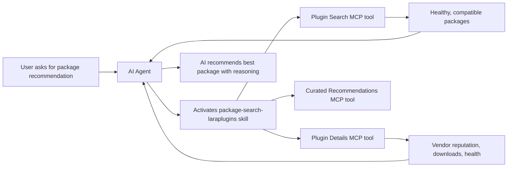

# LaraPlugins Skills

[Laravel Boost](https://github.com/laravel/boost) skill and guideline package for the [LaraPlugins](https://laraplugins.io) MCP server. Provides AI coding agents with the ability to search, verify health scores, and get curated recommendations for Laravel packages.

## Requirements

- PHP 8.2+
- Laravel Boost (`laravel/boost`) installed in your project

## Installation

```bash
composer require danielpetrica/laraplugins-skills --dev
```

Then run the Boost install command:

```bash
php artisan boost:install
```

During installation, select `danielpetrica/laraplugins-skills` when prompted for third-party packages. Boost will automatically install both the **guideline** (always loaded) and the **skill** (on-demand).

## Usage

### What gets installed

- **Guideline** — loaded upfront by your AI agent, tells it about LaraPlugins and when to activate the skill
- **Skill** (`package-search-laraplugins`) — activated on-demand when searching for packages, checking health, or getting recommendations

### MCP Server

The package registers the LaraPlugins MCP server tools:

| Tool | Description |
|------|-------------|
| **Plugin Search** | Search Packagist with filters (vendor, health, Laravel/PHP version, security badge) |
| **Plugin Details** | Get health score, vendor reputation, downloads, GitHub info for a specific package |
| **Curated Recommendations** | Get tool recommendations by category (hosting, monitoring, auth, payments, etc.) |

If your AI agent or IDE requires manual MCP configuration, add this to your `.mcp.json`:

```json
{
    "mcpServers": {
        "laraplugins": {
            "type": "streamable-http",
            "url": "https://laraplugins.io/mcp/plugins"
        }
    }
}
```

## How It Works



## Links

- [LaraPlugins](https://laraplugins.io) — Laravel package discovery and health checks
- [Laravel Boost](https://github.com/laravel/boost) — AI-assisted Laravel development accelerator
- [Packagist](https://packagist.org/packages/danielpetrica/laraplugins-skills)
